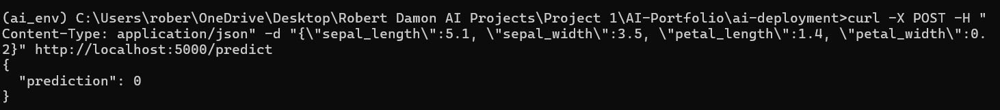

# AI Web App Deployment Project (Flask for Iris Model Serving)

## Overview
Deploys my Iris model as web API.

Key Learnings:
- Model Serialization and Loading: Used Joblib to save (joblib.dump) and load (joblib.load) the trained model, allowing reuse without retraining. This teaches efficient model persistence for deployment.
- Flask Basics: Created a minimal web server with Flask (app = Flask(__name__)), defined routes (@app.route), handled POST requests (request.get_json), and returned JSON (jsonify). This shows how to build APIs for ML inference.
- Input/Output Handling: Parsed JSON input into features, made predictions, and formatted output as JSON. Added try/except for robustness (e.g., missing keys return error messages).
- API Testing: Used curl for command-line testing and Postman for GUI verification, teaching endpoint debugging and simulation of client requests.
- Feature Name Matching: Resolved Scikit-Learn warnings by using Pandas DataFrames with column names matching training data, emphasizing data consistency in deployment.
- Port and Connection Issues: Debugged localhost connection resets by changing ports, using 127.0.0.1, and adjusting firewall rules, highlighting real-world networking challenges.
- JSON Serialization: Converted numpy types (e.g., int64) to Python int for jsonify, preventing serialization errors.

## How to Run
1. Clone: `git clone https://github.com/Rdamon223/AI-Portfolio.git`
2. Navigate: `cd ai-portfolio/ai-deployment`
3. Copy iris_model.pkl from Project 1.
4. Install: `pip install -r requirements.txt`
5. Run: `python app.py`

Expected: Prediction e.g., {"prediction":0}.

## Results
API Test:

## Lessons Learned
- Deployment is simple with Flask but requires careful data formatting (e.g., feature names) to avoid warnings—using DataFrames fixed Scikit-Learn mismatches.
- Local testing with curl/Postman is essential for debugging connection/port issues; firewall tweaks and IPv4 (127.0.0.1) resolved resets.
- JSON serialization needs type conversions (numpy int64 to int) to prevent errors on return.
- For production, add authentication (e.g., API keys), deploy to Heroku/AWS, or use FastAPI for async support. Scale with Gunicorn for concurrency.
- Limitations: Single-threaded on CPU; no error logging—add logging module for real apps.
- Future Enhancements: Integrate with Project 5's chatbot for AI-driven queries, or add Swagger for API docs.