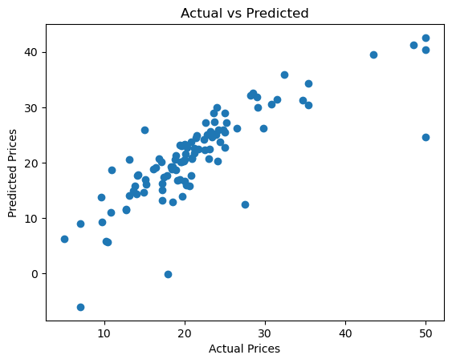

# House Price Prediction Project

## Overview
This regression project predicts Boston house prices using features like rooms and crime rate. Built with Scikit-Learn, it compares Linear and Ridge models, emphasizing preprocessing and evaluation. Part of my AI portfolio to demonstrate numerical prediction skills.

Key Learnings:
- Feature scaling and engineering.
- Regression metrics (MSE, R²).
- Model comparison for better accuracy.

## How to Run
1. Clone: `git clone https://github.com/Rdamon223/AI-Portfolio.git`
2. Navigate: `cd ai-portfolio/house-price-prediction`
3. Install: `pip install -r requirements.txt`
4. Run: `jupyter notebook house_predictor.ipynb`

Expected: MSE ~25, R² ~0.75.

## Results
Actual vs Predicted plot:

