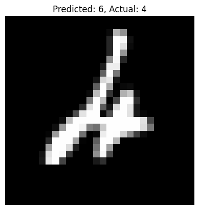

# Image Classification Project

## Overview
This computer vision project classifies handwritten digits (MNIST) using a PyTorch CNN. It demonstrates image preprocessing, model building, training, and error analysis, showcasing deep learning skills for my AI portfolio.

Key Learnings:
- Building CNNs with convolutional and dropout layers to prevent overfitting.
- Preprocessing images with normalization and batching.
- Analyzing misclassifications to understand model limitations.

## How to Run
1. Clone: `git clone https://github.com/Rdamon223/AI-Portfolio.git`
2. Navigate: `cd ai-portfolio/image-classification`
3. Install: `pip install -r requirements.txt`
4. Run: `jupyter notebook digit_classifier.ipynb`

Expected: Train accuracy ~99.52%, test accuracy ~98.68%.

## Results
Achieved 99.52% train accuracy and 98.68% test accuracy, indicating strong generalization with minimal overfitting.

Misclassified Example:

