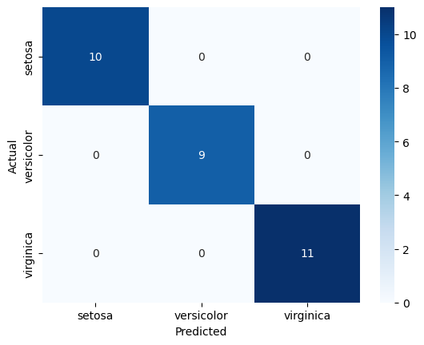

Iris Flower Classification Project
Overview
This project demonstrates a basic machine learning classification task using the Iris dataset. It classifies iris flowers into three species (Setosa, Versicolor, Virginica) based on features like sepal and petal measurements. Built with Scikit-Learn, it covers data loading, preprocessing, model training (Random Forest), evaluation (accuracy and confusion matrix), and visualization. This serves as an introduction to supervised learning and is part of my AI portfolio to showcase foundational ML skills.

Key Learnings:

Handling tabular data with Pandas and NumPy.
Splitting datasets for training and testing.
Training and evaluating ensemble models.
Visualizing results with Matplotlib and Seaborn.
How to Run
Clone the repository: git clone https://github.com/Rdamon223/AI-Portfolio.git
Navigate to the project: cd ai-portfolio/iris-classification
Install dependencies: pip install -r requirements.txt (assumes you have Python 3.12+ and the listed libraries like scikit-learn, pandas, etc.)
Open the notebook: Run jupyter notebook iris_classifier.ipynb in your terminal or Anaconda Prompt.
Execute the cells step-by-step in Jupyter (or VS Code with Jupyter extension) to train the model and see results.
Expected Output: Accuracy around 97% on the test set.

Results
Here's a screenshot of the confusion matrix from the evaluation:

(If running locally, the plot will display inline in the notebook.)