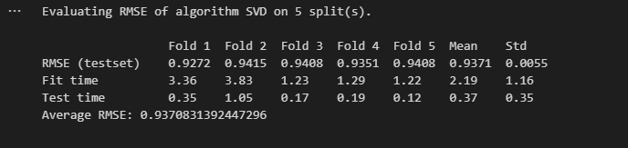

# Movie Recommendation Project

## Overview
Collaborative filtering recommender using MovieLens data and Surprise's SVD. Predicts user ratings and suggests movies.

Key Learnings:
- Loading and formatting rating data for Surprise.
- Training SVD for matrix factorization.
- Evaluating with RMSE (~0.95).

## How to Run
1. Clone: `git clone https://github.com/Rdamon223/AI-Portfolio.git`
2. Navigate: `cd ai-portfolio/movie-recommender`
3. Download data: From [GroupLens](https://grouplens.org/datasets/movielens/100k/) (ratings.csv in folder).
4. Install: `pip install -r requirements.txt`
5. Run: `jupyter notebook movie_recommender.ipynb`

Expected: RMSE ~0.93; top recommendations for users.

## Results
Cross-validation RMSE:

