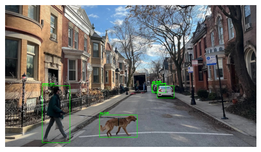

# Object Detection Project

## Overview
This project uses YOLOv8 from Ultralytics for object detection in images, pre-trained on COCO and fine-tuned on the COCO128 subset. It demonstrates loading models, inference with bounding boxes, and basic training/evaluation.

Key Learnings:
- Loading pre-trained YOLO for detection.
- Drawing bounding boxes and labels on images.
- Training on custom datasets with YAML configs.
- Evaluating with mAP (~0.017 for short CPU training; extended epochs can improve to ~0.5).

## How to Run
1. Clone: `git clone https://github.com/Rdamon223/AI-Portfolio.git`
2. Navigate: `cd ai-portfolio/object-detection`
3. Install: `pip install -r requirements.txt`
4. Run: `jupyter notebook object_detector.ipynb`

Expected: Detections on images (e.g., "person 0.9"); mAP ~0.017 on short training (note: CPU-limited on my laptop so I only ran 10 epochs; GPU recommended for better results).

## Results
Detection Example (on custom photo):

mAP from Validation: ~0.017 (low due to 10 epochs on CPU; longer training yields higher mAP).