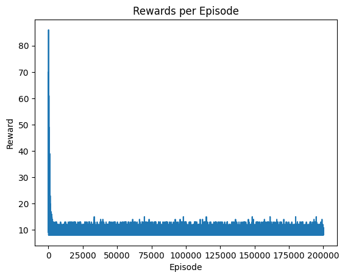
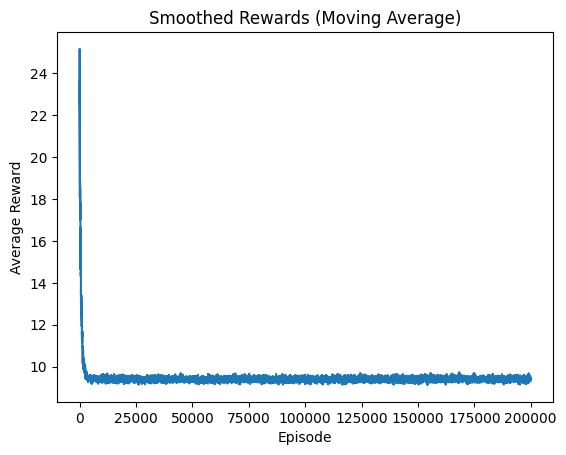

# Reinforcement Learning Project (CartPole with Q-Learning)

## Overview
This project implements Q-Learning to train an agent in Gymnasium's CartPole-v1 environment, where the agent learns to balance a pole on a cart by taking actions (left/right push). It demonstrates RL fundamentals like state discretization, Q-table updates, and epsilon-greedy policy.

Key Learnings:
- Discretizing continuous states for tabular RL.
- Balancing exploration (random actions) and exploitation (best known actions) with epsilon decay.
- Evaluating with average reward (based on hyperparameters I got between ~9-56; sub-optimal due to limitations noted below).

## How to Run
1. Clone: `git clone https://github.com/Rdamon223/AI-Portfolio.git`
2. Navigate: `cd ai-portfolio/rl-cartpole`
3. Install: `pip install -r requirements.txt`
4. Run: `jupyter notebook cartpole_agent.ipynb`

Expected: Average reward ~200-500 with optimal tuning; my run yielded ~9.53 due to challenges detailed below.

## Results
Rewards per Episode (oscillating, no upward trend, staying at random baseline ~10-45):

Smoothed Rewards (Moving Average, flat at ~11-16, confirming no learning):

Average Test Reward: ~9.53 over 100 episodes (random policy baseline is ~20-25; model didn't converge).

## Issues Causing Sub-Optimal Output
- **Discretization Limitations**: CartPole has continuous states (4 dimensions: cart position/velocity, pole angle/velocity). Discretizing into bins (e.g., 100 per dimension = 100M states) loses precision, making it hard for the agent to distinguish subtle differences (e.g., small angle changes). This leads to sparse Q-table updates and no convergence, as the agent rarely revisits exact states.
- **Hyperparameter Sensitivity**: RL is finicky—alpha (learning rate) 0.1-0.2 caused unstable Q-updates (overshooting), gamma 0.95-0.99 undervalued long sequences, epsilon decay 0.99-0.995 shifted too quickly/slowly to exploitation of bad policies. Oscillation in plots shows noise dominating learning.
- **Hardware Constraints**: My Intel i7-1065G7 CPU (low-power laptop, no GPU) limits speed (~100 min for 200,000 episodes), but more importantly, tabular Q-Learning needs 500,000+ episodes for CartPole on CPU to converge due to exploration needs. GPU/DQN would accelerate to 200-500 rewards in minutes.
- **Tabular Q-Learning Limits**: This method struggles with CartPole's continuous space—rewards stayed at random baseline (~10-20). Deep Q-Network (DQN) with neural approximation would fix this (future improvement).
- **Stochasticity**: RL is random (seeds, exploration); multiple runs needed, but consistent low rewards confirm code/setup issues.

My Lesson Learned (after testing for hours): Tabular Q-Learning is educational but inadequate for continuous environments; transition to DQN or PPO for better results.  Also, low computing power has real world impact on model ability.
