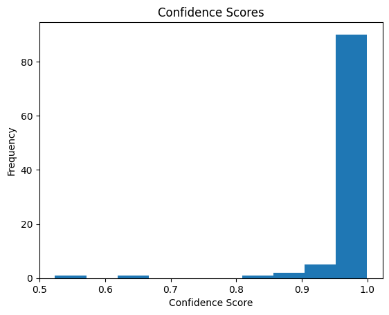

# Sentiment Analysis Project

## Overview
This NLP project classifies movie reviews as positive or negative using Hugging Face's DistilBERT model on the IMDB dataset. It demonstrates text preprocessing, pre-trained model inference, and result visualization, showcasing my ability to handle unstructured text data in AI.

Key Learnings:
- Using Hugging Face Transformers for quick sentiment analysis.
- Tokenization and truncation for handling variable-length texts.
- Evaluating and visualizing model confidence.

## How to Run
1. Clone: `git clone https://github.com/Rdamon223/AI-Portfolio.git`
2. Navigate: `cd ai-portfolio/sentiment-analysis`
3. Download dataset: Get `IMDB Dataset.csv` from [Kaggle](https://www.kaggle.com/datasets/lakshmi25npathi/imdb-dataset-of-50k-movie-reviews) and place in folder.
4. Install: `pip install -r requirements.txt`
5. Run: `jupyter notebook sentiment_analyzer.ipynb`

Expected: Accuracy ~90% on 100 reviews.

## Results
Confidence scores histogram:

