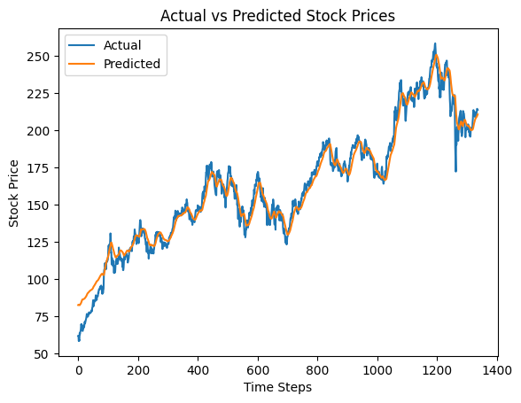

# Time Series Forecasting Project

## Overview
LSTM model for AAPL stock prediction using Yfinance data.

Key Learnings:
- Time series preprocessing and sequencing.
- LSTM for sequential forecasting.
- MAE evaluation (~7.00).

## How to Run
1. Clone: `git clone https://github.com/Rdamon223/AI-Portfolio.git`
2. Navigate: `cd ai-portfolio/time-series-forecast`
3. Install: `pip install -r requirements.txt`
4. Run: `jupyter notebook stock_forecaster.ipynb`

Expected: MAE ~7; plot of predictions.

## Results
Actual vs Predicted:

